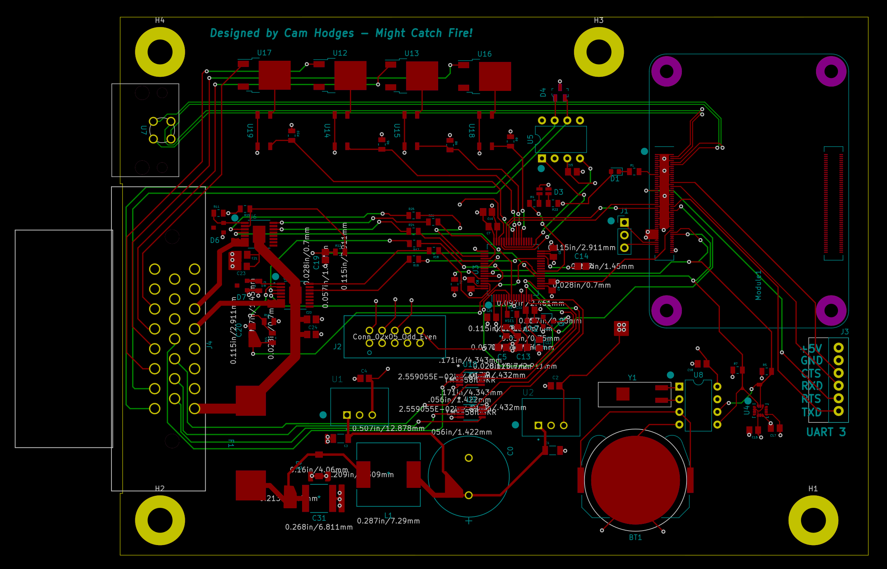
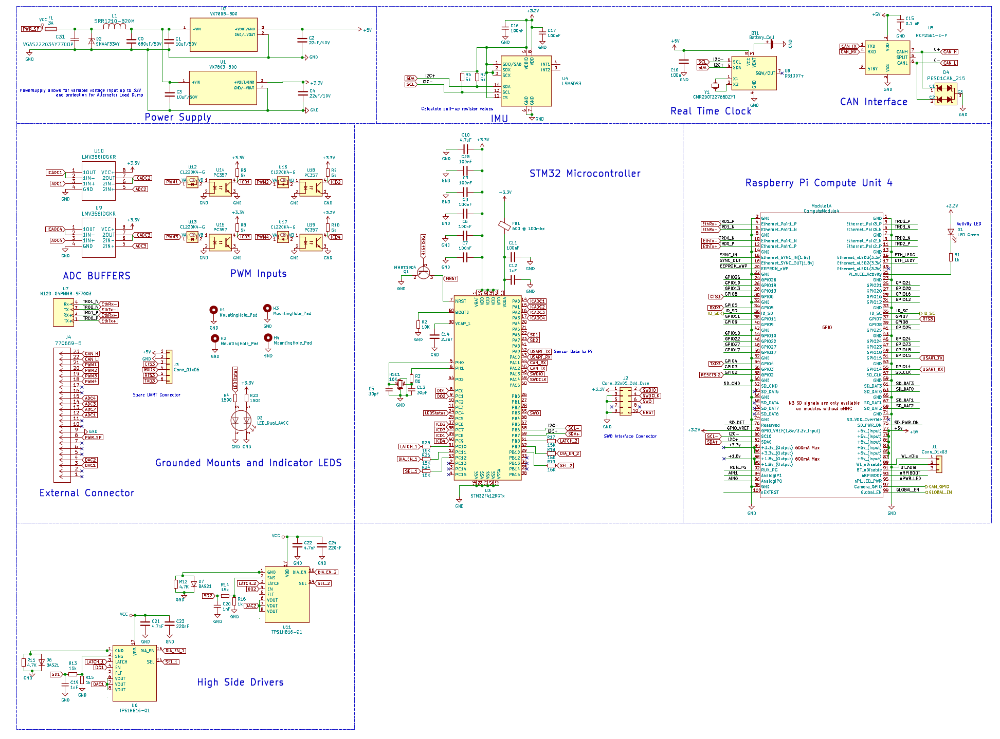
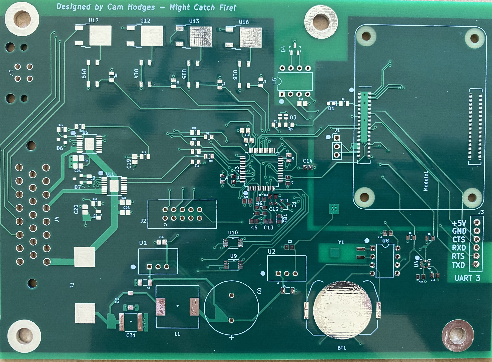

## Electronics Design
Raspberry Pi and STM32 with sensors and interfaces on a single PCB

The purpose of this project is to create a single custom PCB design including a Raspberry Pi CM4, STM32 Micro controller, 6 axis single chip IMU, CAN datalink and supporting power supplies. 

This is intended to be a general purpose controller or datalogger. The STM32 allows for high speed IO tasks while the CM4 supports more complex computations and remote access using something like AWS GreenGrass.

